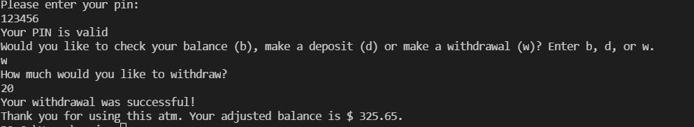

# ATM Application

ATM Application is a command-line interface application for users to log in, check balance, make deposit, and withdraw written in python.

---

## Technologies


This project leverages python 3.7 with the following packages:


* [questionary](https://github.com/tmbo/questionary) - For interactive user prompts and dialogs

---

## Installation Guide

Before running the application first install the following dependencies.

```python
 
  pip install questionary
```

## Usage

To use the ATM application simply clone the repository and run the **atm.py** with the response to the questionaire:

```python
python atm.py 
```
Upon launching the ATM Appyou will be greeted with the following prompts.



---

---

## Contributors

Brought to you by Eunice Huang.

## License

MIT